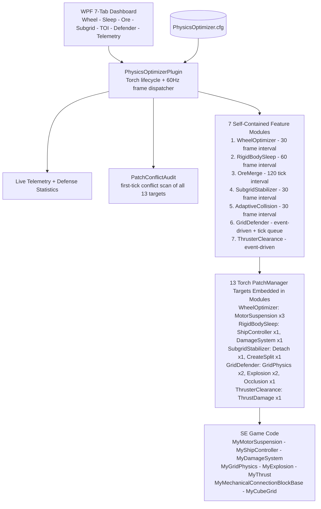

# ⚡ GVK Physics Optimizer

**Unified High-Performance Havok Physics Optimization & Collision Defense Engine for Space Engineers Dedicated Servers (Torch)**

* **Plugin Type**: Torch Dedicated Server Plugin (.NET Framework 4.8, x64, WPF UI)
* **Target Environment**: Space Engineers Dedicated Servers / Torch (Universal Standalone Plugin, battle-tested on GV: Deserts of Kharak)
* **Package**: `GVK_PhysicsOptimizations.zip` (plugin DLL + PDB + manifest)
* **Version**: 2.0.0 (in-log and command branding; `manifest.xml` / `.csproj` `<Version>` fields still read 1.0.0 - bump at next release)

---

## 1. Project Intent & Core Philosophy

In Space Engineers, Havok physics calculations consume up to 60-70% of server CPU time on rover-heavy and combat worlds. When rovers collide with voxels, thrusters burn internal armor, or idle grids drift, the server sim-speed craters.

**`PhysicsOptimizer` (v2.0)** is a unified server-side physics overhaul. It permanently fuses high-performance suspension and rigid body deactivation routines with the battle-tested structural collision defenses formerly housed in `GridDefender`. The engine delivers a locked **60 TPS server sim-speed** while actively preventing Clang kraken events, phantom forces, and voxel tunneling.

The plugin is built from exactly **13 Torch PatchManager patch targets** across 8 patch files, **5 stepped simulation modules**, **1 event-driven collision defense engine**, and **1 event-driven thruster clearance engine**. All 13 targets are enumerated in Section 4; every feature system that consumes them is documented in Section 5.

### Key Performance & Defense Pillars:
* 🏎️ **Consolidated Wheel & Suspension Physics**: Eliminates wheel-well armor compound queries via symmetrical broadphase collision masks, discovers world rovers on server cold-start, and sleeps 60Hz raycasts on parked rovers with a ~1ns short-circuit flag.
* 💤 **Aggressive Rigid Body Sleeping**: Actively forces motionless unpiloted dynamic grids into Havok sleep mode (`rigidBody.Deactivate()`), backed by fail-safe gravity/landing-gear/thruster guards and three independent instant-wake paths.
* ⛏️ **$O(N)$ Proximity Ore & Item Merging**: Merges floating ore boulders and dropped components using spatial grid hashing and object pooling, slashing active rigid body counts with zero heap allocations.
* 🦾 **Subgrid Constraint Stabilizer & Detach Reset**: Synchronizes Havok micro-velocities across resting mechanical subgrids (rotors/hinges/pistons) to kill Clang vibration loops, masks tiny utility subgrids out of broadphase, and forces an immediate broadphase refresh on detach/split to eliminate the persistent subgrid "ghost" collision bug.
* 🚀 **Adaptive TOI & Heightmap Reversion**: Dynamically assigns discrete collision quality to cruising grids to cut continuous TOI pairs, while reverting to Continuous TOI near planetary surfaces, near other dynamic grids, for small craft, and always for PMW missiles.
* 🎯 **Deformation Defense Engine (8-Stage Pipeline)**: A single gate on `MyGridPhysics.PerformDeformation` that classifies every collision - subgrid contacts, floating debris, PMW missiles, docking bumps, station strikes, terrain crashes, ship ramming - and suppresses or scales deformation damage accordingly.
* 🛡️ **Layered Armor Occlusion**: A `MyDamageSystem` before-damage handler that shields interior components behind true structural armor blocks from spherical deformation damage bleed.
* 🔥 **Instant Thruster Clearance & Vaporization** (own module, `ThrusterClearance`): Replaces expensive volumetric Havok shape casts with tiered 1/5/9-ray nozzle raycasts. External grids (landing pads) receive immunity in Optimized mode, while illegally buried thrusters instantly vaporize their own obstructing blocks.
* ⛰️ **Voxel Normal Arbitrator & Cutout Suppression**: Eliminates "Voxel-Vice" terrain trapping by detecting inverted downward contact normals against voxels and correcting them, and suppresses explosive voxel carving to preserve planetary terrain.
* 🎪 **Anti-Clang Vibration Arrest & Push-Apart**: Detects grids stuck in consecutive-contact feedback loops, dampens their velocities, and physically nudges them out of terrain or overlapping grids along the gravity up-vector.
* ⚡ **Zero Hot-Path Allocations**: Zero memory allocations in simulation loops with stepped evaluation intervals (30-120 frames), atomic telemetry updates, pooled collections, and deterministic entity eviction on despawn.

---

## 2. System Architecture



All patches are registered through **Torch PatchManager** (`PatchContext.GetPattern` + `Prefixes`/`Suffixes`) - Torch's own MSIL rewriter, not Harmony. Every target is also registered into `PatchConflictAudit`, which runs once on the first session tick and warns on any foreign detour (Torch or raw-Harmony) touching our methods.

### Project Structure & Component Index

| Component | File | Description |
| :--- | :--- | :--- |
| **Plugin Entry** | [`PhysicsOptimizerPlugin.cs`](PhysicsOptimizations/PhysicsOptimizerPlugin.cs) | Central lifecycle manager (`TorchPluginBase`, `IWpfPlugin`). Frame-counter dispatcher for all modules, patch registration, entity add/remove hooks, config persistence, and console telemetry heartbeat. |
| **Config Model** | [`Config/PhysicsOptimizerConfig.cs`](PhysicsOptimizations/Config/PhysicsOptimizerConfig.cs) | Persistent ViewModel managing all engine toggles, thresholds, logging flags, and collision defense properties. |
| **Optimizer Interface** | [`Modules/IPhysicsOptimizer.cs`](PhysicsOptimizations/Modules/IPhysicsOptimizer.cs) | Common contract for all feature optimizers: `Init`, `Update`, `OnEntityAdded/Removed`, `UpdateConfig`, `Dispose`. |
| **Optimization Telemetry** | [`Services/OptimizationTelemetry.cs`](PhysicsOptimizations/Services/OptimizationTelemetry.cs) | Thread-safe live gauges for active/sleeping bodies, rovers, wheels, ore merges, TOI states, and subgrids. Includes diagnostic clipboard export. |
| **Defense Statistics** | [`Services/DefenseStatistics.cs`](PhysicsOptimizations/Services/DefenseStatistics.cs) | Cumulative counters: evaluated/blocked/allowed deformations, missile hits, ramming/voxel/subgrid/low-speed/station/debris/cooldown blocks, clang arrests, grids separated, armor occlusions, voxel normals inverted, thruster vaporizations, voxel cutouts prevented, piloted buggy saves. |
| **Module 1: Wheel Optimizer** | [`Modules/WheelOptimizer.cs`](PhysicsOptimizations/Modules/WheelOptimizer.cs) | Symmetrical broadphase collision masking (`subSystemDontCollideWith = 3`), cold-start rover discovery, and parked suspension sleeping. Owns 3 `MyMotorSuspension` detours. |
| **Module 2: Rigid Body Sleep** | [`Modules/RigidBodySleep.cs`](PhysicsOptimizations/Modules/RigidBodySleep.cs) | Stepped evaluator forcing idle dynamic grids into Havok sleep mode (`rigidBody.Deactivate()`) with safety guards. Owns cockpit input and damage wake detours. |
| **Module 3: Ore Merge** | [`Modules/OreMerge.cs`](PhysicsOptimizations/Modules/OreMerge.cs) | $O(N)$ spatial grid cell bucketing merging nearby matching ore and dropped item stacks with pooled collections. |
| **Module 4: Subgrid Stabilizer** | [`Modules/SubgridStabilizer.cs`](PhysicsOptimizations/Modules/SubgridStabilizer.cs) | Havok micro-velocity synchronization across resting mechanical subgrids, collision masking of tiny utility subgrids, and broadphase ID resets on detach and split. |
| **Module 5: Adaptive Collision** | [`Modules/AdaptiveCollision.cs`](PhysicsOptimizations/Modules/AdaptiveCollision.cs) | Switches slow cruising grids to discrete collision quality while preserving Continuous TOI via a 4-level safety priority chain. |
| **Module 6: Grid Defender** | [`Modules/GridDefender.cs`](PhysicsOptimizations/Modules/GridDefender.cs) | Zero-cost collision defense: 8-stage deformation pipeline, PMW engagement tracking, anti-clang vibration arrest, push-apart queue, and layered armor occlusion. Owns 6 detours. |
| **Module 7: Thruster Clearance** | [`Modules/ThrusterClearance.cs`](PhysicsOptimizations/Modules/ThrusterClearance.cs) | Replaces Keen's volumetric thruster flame shape-casts with tiered 1/5/9-ray nozzle raycasts; own-construct obstructions vaporize in Optimized mode, external grids immune. Owns 1 `MyThrust` detour. |
| **Logging Facade** | [`Utils/Log.cs`](PhysicsOptimizations/Utils/Log.cs) | Centralized logging facade with standard `[{tag}] message` formatting. |
| **Patch Conflict Audit** | [`Utils/PatchConflictAudit.cs`](PhysicsOptimizations/Utils/PatchConflictAudit.cs) | One-shot first-tick audit of all 13 targets: checks Torch PatchManager rewrite patterns for foreign detours and raw-Harmony patch ownership. |
| **Grid Utilities** | [`Utils/GridUtils.cs`](PhysicsOptimizations/Utils/GridUtils.cs) | High-performance grid size queries, linear speed calculations, and mechanical/logical grouping checks. |
| **Admin Commands** | [`Commands/PhysicsOptimizerCommands.cs`](PhysicsOptimizations/Commands/PhysicsOptimizerCommands.cs) | In-game and Torch console admin commands under the `!phys` prefix using culture-invariant parsing and plain ASCII. |
| **WPF GUI Control** | [`Views/PhysicsOptimizerControl.xaml`](PhysicsOptimizations/Views/PhysicsOptimizerControl.xaml) | 3-tab WPF interface: **Physics Optimizations** (Wheel Optimizer, Rigid Body Sleep, Ore Merge, Subgrid Stabilizer, Adaptive Collision, and Thruster Clearance sections), **Grid Defender**, and **Live Telemetry**. |

---

## 3. The 6 Self-Contained Feature Modules

All modules are driven off the plugin's shared frame counter, run server-authoritative only, and evaluate on stepped intervals with zero hot-path allocations.

| # | Module | Interval | Purpose |
| :- | :--- | :--- | :--- |
| 1 | `WheelOptimizer` | 30 frames (0.5s) | Rover discovery/tracking, symmetrical wheel broadphase masking, parked suspension sleep. |
| 2 | `RigidBodySleep` | 60 frames (1s) | Forced Havok deactivation of idle unpiloted dynamic grids + gated wake paths. |
| 3 | `OreMerge` | `OreMergeIntervalTicks` (min 30, default 120) | Spatial-hash proximity merge of floating ore/items (server only). |
| 4 | `SubgridStabilizer` | 30 frames (0.5s) | Micro-velocity sync of resting mechanical joints + small utility subgrid masking + detach broadphase refresh. |
| 5 | `AdaptiveCollision` | 30 frames (0.5s) | Dynamic Discrete/Continuous TOI collision quality management. |
| 6 | `GridDefender` | 60Hz + event-driven | Zero-cost collision defense, anti-clang damping, push-apart, layered armor occlusion. |
| 7 | `ThrusterClearance` | Event-driven (static) | Tiered nozzle raycast thruster clearance. |

---

## 4. The 13 Torch PatchManager Patch Targets

Every game method this plugin patches, in registration order. All targets are registered into `PatchConflictAudit` at registration time.

| # | Patched Game Method | Type | Declaring Module | Consumed By |
| :- | :--- | :--- | :--- | :--- |
| 1 | `MyMotorSuspension.CreateConstraint` | Suffix | `WheelOptimizer.cs` | System 1 (Wheel Masking) |
| 2 | `MyMotorSuspension.CubeGrid_OnPhysicsChanged` | Suffix | `WheelOptimizer.cs` | System 1 (Wheel Masking re-apply) |
| 3 | `MyMotorSuspension.Update` | Prefix | `WheelOptimizer.cs` | System 1 (Parked Suspension Sleep) |
| 4 | `MyShipController.MoveAndRotate(Vector3, Vector2, float)` | Suffix | `RigidBodySleep.cs` | System 2 (Instant Pilot Wake) |
| 5 | `MyDamageSystem.RaiseAfterDamageApplied` | Suffix | `RigidBodySleep.cs` | System 2 (Universal Damage Wake) |
| 6 | `MyGridPhysics.PerformDeformation` | Prefix | `GridDefender.cs` | System 7 (Defense Pipeline) |
| 7 | `MyGridPhysics.RigidBody_ContactPointCallbackImpl` | Prefix | `GridDefender.cs` | Systems 7, 8, 12 (Impact Context + Voxel Normal Arbitrator) |
| 8 | `MyExplosion.ApplyExplosionOnVoxel` | Prefix | `GridDefender.cs` | System 13 (Voxel Cutout Suppression) |
| 9 | `MyExplosion.CutOutVoxelMap` | Prefix | `GridDefender.cs` | System 13 (Voxel Cutout Suppression) |
| 10 | `MyDamageSystem.LoadData` (fallback `Init`) | Suffix | `GridDefender.cs` | System 10 (Layered Armor Occlusion handler registration) |
| 11 | `MyThrust.ThrustDamageAsync` (fallback `DamageGrid`) | Prefix | `ThrusterClearance.cs` | System 11 (Thruster Clearance) |
| 12 | `MyMechanicalConnectionBlockBase.Detach(MyCubeGrid, bool)` | Suffix | `SubgridStabilizer.cs` | System 5 (Detach Broadphase Reset) |
| 13 | `MyCubeGrid.CreateSplit` (static) | Suffix | `SubgridStabilizer.cs` | System 5 (Grid Split Broadphase Reset) |

**Hard rules**: never add a 14th target without running the compatibility audit (see Design Notes); never patch `MyEntityComponentUpdater.*` / the per-entity update dispatch family (Concealment's home turf); never strip `GC.Collect` call sites transpiled by `se-performance-improvements`.

---

## 5. Feature Systems Deep-Dive

#### 🏎️ System 1: Wheel & Suspension Physics Optimizer
*File: `Modules/WheelOptimizer.cs` (targets 1-3)*

* **Symmetrical Broadphase Collision Masking**: Vanilla SE sets asymmetrical collision masks (`1, 1` on wheels vs `0, 0` on chassis), forcing Havok to run expensive compound shape tree queries against nearby armor blocks (fenders, wheel skirts) every tick. The optimizer applies `HkGroupFilter.CalcFilterInfo(layer, systemId, 1, 3)` (sub-system bits 0 and 1 ignored) to the wheel body via the `CreateConstraint` and `CubeGrid_OnPhysicsChanged` suffixes, then calls `MyPhysics.RefreshCollisionFilter` on both grids - eliminating redundant checks while preserving wheel-to-ground contact.
* **Cold-Start Rover Discovery**: Scans world entities on module init (`DiscoverExistingRovers`) and via `MyEntities.OnEntityAdd` to immediately index and mask pre-existing and newly spawned rovers (any grid whose `GridSystems.WheelSystem` reports wheels).
* **Parked Rover Suspension Sleep**: Evaluated every 30 frames. When a rover's handbrake is engaged and it remains nearly stationary (< 0.1 m/s linear, < 0.02 rad/s angular) for `RoverSleepDelaySeconds` (default 2.0s), the `MyMotorSuspension.Update` prefix returns `false`, skipping the expensive per-frame suspension math, 60Hz ground raycasts, air-shock checks, and artificial braking impulses. Uses a static `volatile bool HasAnySleepingRovers` flag so active rovers skip dictionary lookups in ~1ns.
* **Instant Wakeup**: Handbrake release, velocity drift (sliding down a Pertam dune while parked), pilot movement input (System 2), or external damage (System 2) all wake the suspension instantly.

### 💤 System 2: Rigid Body Sleep Manager & Universal Wake Paths
*File: `Modules/RigidBodySleep.cs` (targets 4-5)*

* **Stepped Scan**: Every 60 frames, sweeps all entities for dynamic grids (static grids skipped) without hot-path allocations.
* **Sleep Conditions**: An unpiloted dynamic grid sustaining linear velocity < 0.05 m/s and angular velocity < 0.01 rad/s for `IdleSecondsBeforeSleep` (default 3s) is deactivated with `grid.Physics.RigidBody.Deactivate()`. Grids with a voxel contact in the last 30 sim frames are never force-slept - sleeping bodies emit no contact callbacks, so terrain-grinding grids must stay awake for push-apart to rescue them.
* **Gravity Support Guard** (`IsGridSafelySupportedOrNotInGravity`):
  * Grids outside significant gravity sleep freely.
  * Grids in gravity must be supported: wheels with handbrake engaged, landing gear / magnetic feet locked (`LandingSystem.IsParked` or gear lock All/Mixed), or be an unpowered wreck at rest on terrain.
  * Grids with thrusters actively fighting gravity (`IsWorking` and `ThrustForceLength > 0.01` or `ThrustOverride > 0`) are never frozen mid-air.
* **Pilot Guard**: Grids with seated pilots never sleep; `ForceSleepAllIdleGrids` (admin command) also skips piloted grids.
* **Instant Wake Paths** (each gated by its owning feature toggle):
  1. **Pilot input**: the `MyShipController.MoveAndRotate` suffix detects any non-zero move/rotation/roll input. It wakes parked rover suspensions (`WheelOptimizer`) and, only when `EnableRigidBodySleep` is true, wakes the grid rigid body (`RigidBodySleep`).
  2. **Damage**: the `MyDamageSystem.RaiseAfterDamageApplied` suffix wakes the owning grid on any damage event with `Amount > 0` - catches vanilla ballistics/missiles, WeaponCore projectiles and energy beams, grinder ticks, explosions, and physical impacts. The handler accepts both `MySlimBlock` and `MyCubeGrid` targets. Rigid-body wake only fires while `EnableRigidBodySleep` is true; suspension wake is controlled by `EnableWheelOptimizer`.
* **Disable behavior**: When `EnableRigidBodySleep` is turned off, all forced-sleep trackers are cleared on the next update so previously sleeping grids cannot be woken by this system.

### ⛏️ System 3: Floating Object & Ore Optimizer
*File: `Modules/OreMerge.cs`*

* **O(N) Spatial Grid Hashing**: Replaces O(N^2) all-pairs distance loops with spatial cell bucketing (cell size = merge radius), scanning only adjacent neighborhood cells with a same-cell dedup offset.
* **Zero-Allocation Pooling**: Pooled list buffers and bucket recycling (`RecycleBuckets`) eliminate GC allocations during proximity sweeps; all buffers cleared in `finally`.
* **Entity Elimination**: Matching `TypeId` + `SubtypeName` pairs within `OreMergeRadiusMeters` (default 3.0m, squared-distance check) merge their amounts into the primary stack (`primary.Amount.Value +=`, `RefreshDisplayName`) and the redundant entity is `Close()`d - reducing debris rigid body counts directly at the Havok source.
* **Server Authority**: Merge passes run only when `Sync.IsServer`.

### 🦾 System 4: Subgrid Constraint Stabilizer & Small Utility Masking
*File: `Modules/SubgridStabilizer.cs`*

* **Joint Rest Detection**: Every 30 frames, monitors all `MyMechanicalConnectionBlockBase` joints (suspensions excluded) with a `TopGrid`. A joint is at rest when the subgrid's relative linear velocity is negligible, relative angular velocity is below `SubgridRestVelocityThreshold` (0.005 rad/s), and the joint is uncommanded (rotor unlocked with ~0 target RPM; piston idle and not extending/retracting).
* **Micro-Velocity Synchronization**: After `SubgridRestFramesThreshold` (default 60 frames worth of 30-tick passes, ~1s) of continuous rest, the joint is marked stabilized and - on every subsequent pass - the subgrid's `AngularVelocity` and `LinearVelocity` are hard-synced to the parent grid whenever they diverge. This kills constraint solver micro-oscillations and Clang vibration feedback loops at the source. Any pilot command or motion immediately de-stabilizes the joint.
* **Small Utility Subgrid Masking** (`MaskSmallUtilitySubgrids`, max `MaskSmallUtilitySubgridMaxBlocks` = 10): Subgrids at or under the block cap get the same symmetrical broadphase mask as wheels (`CalcFilterInfo(layer, systemId, 1, 3)` + filter refresh) so their chassis pairs stop generating contact work. **Hard blacklist**: any subgrid containing user-controllable guns, ship tools, or warheads is never masked - closing the phantom-hull and retracting-weapon exploits (see Graveyard entry 2).

### 🧲 System 5: Detach & Grid-Split Broadphase Reset
*File: `Modules/SubgridStabilizer.cs` (targets 12-13)*

* **The Bug**: In vanilla SE, detaching a rotor head, hinge, or splitting a grid leaves stale Havok collision filter bits. The detached grid often phases invisibly through the parent grid or gets trapped in phantom contact loops.
* **The Fix**: Suffixes on `MyMechanicalConnectionBlockBase.Detach` and `MyCubeGrid.CreateSplit` reset both affected grids: a fresh collision system group is drawn from the Havok world's collision filter, written into `MyGridPhysics.HavokCollisionSystemID` (reflection), and `MyPhysics.RefreshCollisionFilter` fires immediately - making detached subgrids and split-off hull sections 100% physically solid on Tick 0.
* **Gating**: Active while both `EnableSubgridStabilization` and `MaskSmallUtilitySubgrids` are enabled (the reset exists to keep masked subgrids safe).

### 🚀 System 6: Adaptive TOI (Continuous Collision Detection) & Safety Reversions
*File: `Modules/AdaptiveCollision.cs`*

* **Zero-Touch Sleep Guard**: Bodies already asleep (`!rb.IsActive`) skip evaluation entirely.
* **Dynamic Priority Chain** (evaluated every 30 frames, in order):
  1. **PMW Missiles**: Grids currently qualifying as missiles (System 9) always retain Continuous TOI - zero tunneling for torpedoes.
  2. **Grid-Size Discrete Overrides** (off by default): `EnforceDiscreteLargeGrids` / `EnforceDiscreteSmallGrids` unconditionally assign Discrete (`HkCollidableQualityType.Debris`) to grids meeting their minimum block counts (20 / 40). Missiles bypass these overrides.
  3. **Force-Continuous Safety Reversions** (when `EnableSpeedThresholds` is on):
     * Speed at or above `ContinuousCollisionSpeedThreshold` (40 m/s).
     * Altitude below `ContinuousAltitudeThreshold` (50m) from the closest planetary surface point (`MyGamePruningStructure.GetClosestPlanet` + `GetClosestSurfacePointGlobal`).
     * Another dynamic grid within `DynamicGridProximityRevertDistanceMeters` (500m) - protects dogfights and ramming encounters.
     * Small craft of 40 blocks or fewer always stay continuous (torpedo/buggy safety).
  4. **Discrete Demotion**: Non-overridden grids cruising at or below `DiscreteCollisionSpeedThreshold` (15 m/s) are demoted to `Debris` quality, cutting continuous TOI pair generation.
* **Quality Restoration**: Original `HkCollidableQualityType` is cached per grid and restored on demotion reversal, entity removal, admin restore, and plugin dispose - grids never stay stranded in the wrong quality tier.

### 🎯 System 7: Deformation Defense Engine (8-Stage Collision Pipeline)
*File: `Modules/GridDefender.cs` (target 6)*

The `PerformDeformation` prefix routes every grid collision deformation through a single sequential gate. `impactSpeed` is computed from grid speeds and the separating velocity. Stages, in order:

1. **Subgrid / Mechanical Protection** (`ProtectSubgrids`): Collisions between grids in the same mechanical group (pistons, rotors, hinges, connectors) or same logical group are blocked outright, with anti-clang applied.
2. **Floating Debris Protection** (`ProtectAgainstFloatingObjects`): Deformation caused by `MyFloatingObject` (loose ore, dropped items) is blocked.
3. **Speed Classification**: Impact speed computed once, squared-distance math throughout.
4. **PMW Missile Gate**: See System 9.
5. **Safe Docking / Parking Floor** (`MinDrivingVelocity`, default 10 m/s): Any impact below this speed is suppressed as a docking bump or parking fender-bender.
6. **Extreme Velocity Anti-Freeze Ceiling** (`MaxDeformationVelocity`, default 110 m/s): Non-missile impacts *above* this speed are suppressed with impact damping - ultra-high-speed wrecks don't trigger catastrophic Havok depenetration impulses.
7. **Structural Protection Tiers** (each blocks damage + applies impact damping + anti-clang):
   * A. **Static Stations** (`ProtectStaticGrids`): dynamic grids striking static stations.
   * B. **Terrain Crashes** (`ProtectShipsAgainstVoxels`): grid vs voxel impacts.
   * C. **Ship Ramming** (`ProtectShipsAgainstRamming`): grid vs grid impacts.
8. **Deformation Cooldown** (`DeformationCooldownFrames`, default 30): Rate-limits any remaining unprotected continuous deformation per grid (grinding chains, repeated contact pulses).

**Allow path**: `AllowOrScale` scales the separating velocity by `DeformationMultiplier` (0.0-1.0, default 1.0; 0 disables deformation entirely) and records the cooldown frame.

**Impact Damping**: Suppressed collisions also dampen the striking grid's linear velocity by `max(0, 1 - ImpactVelocityDamping * 0.6)` (default factor 0.7 at `ImpactVelocityDamping` = 0.5), preventing invisible-wall ping-ponging.

**Global Voxel Fakes**: While `SuppressAllVoxelExplosionDamage` is on, the engine holds `MyFakes.DEFORMATION_EXPLOSIONS = false`, disabling Keen's deformation-carving path globally, and restores the vanilla flag on dispose.

### 🎪 System 8: Anti-Clang Vibration Arrest & Push-Apart
*File: `Modules/GridDefender.cs`*

* **Contact Frame Tracking**: Consecutive-frame contact counts are tracked per grid (reset when frames skip).
* **Phase 1 - Vibration Arrest** (`AntiClangVibrationThreshold`, default 8 contact frames): linear velocity *= 0.75, angular velocity *= 0.2; runaway death-spins (|w|^2 > 16) are zeroed entirely when `StopClangSpinning` is on. Suspension wheel subgrids are skipped when `ExcludeWheelSubgridsFromAntiClang` is enabled so wheel spin is not damped mid-drive.
* **Phase 2 - Push-Apart** (`PushApartThreshold`, default 25 contact frames): Separation is queued (never applied inline on the physics thread path) and drained on the plugin's cache sweep. Grid-on-grid pushes fire along the center-to-center direction; grid-on-voxel pushes pick an escape direction in two tiers: on **unmodified voxel regions** (per-region RangeChanged tracking reports them pristine) it is a zero-raycast fast path - the cached contact normal is accepted directly, with any gravity-downward normal reversed as pointing into the planet core (same correction rule as the Normal Force Arbitrator), falling back to the gravity up-vector. On **modified voxel regions** (tracked per carve operation via `MyVoxelBase.RangeChanged` into coarse 32m buckets, so a drilled planet only pays raycasts near actual carving; drilled caves/cutouts have real ceilings) every candidate is raycast-confirmed: contact normal, then gravity-up, then 4 world horizontals - so grids wedged against cliff faces escape sideways instead of staircasing skyward. Each push moves the group by `PushApartDistance` (default 0.5m) with a small 0.8 m/s separation velocity and zeroed angular velocity. Escape direction is sanity-checked against the contact-to-grid-center vector (normals pointing into terrain are flipped), direction is locked across repeated failed rescues with distance escalating 1x to 3x up to `PushApartMaxNudgeDistance` (default 2.0m) to dig out submerged wheels, and gravity-up is the unconditional final fallback - a stuck grid always receives an escape direction and is never pushed downward. An escape-attempt cap (`PushApartMaxAttempts`, default 3, 0 = disabled) stands down pushes on grids that stay voxel-embedded after repeated attempts (budget refunds once voxel contact is lost). Suspension wheel subgrids are skipped when `ExcludeWheelSubgridsFromPushApart` is enabled to prevent normal driving from being treated as stuck. Mechanically/logically connected subgrids and static grids are excluded. Each push is applied to the **entire mechanical group** (wheels are separate physics bodies - moving only the main grid leaves wheels buried), wakes every member's rigid body before applying velocity, and resets the group's contact counters so wheels do not re-clang.
* **Burial Probe** (Experimental, `EnableBurialProbe`): Cold-path check (once per ~10s) for grids stationary ~20s+ confined by voxel material (physics raycasts within `BurialProbeRadius`, default 2m, beyond the bounding sphere): 3+ of 4 horizontal sides for silent burials, relaxed to 2 sides when voxel contact was seen within ~60s (cliff wedges). Fully buried grids emit no contact callbacks, so contact-driven push-apart can never fire for them - the probe queues a rescue push along the gravity up-vector instead. Covers embedded spawns, cliff-wedged rovers, and underground stations converted to ship.
* **Memory Hygiene**: All frame trackers and missile engagements are evicted via `MyEntities.OnEntityRemove` plus a cold-path sweep every 600 frames.

### 🚀 System 9: PMW Kinetic Manager & Piloted Exemption
*File: `Modules/GridDefender.cs`*

* **PMW Classification** (`IsMissile`): An unpiloted dynamic grid is a Player-Made Missile when its speed meets `MissileMinVelocity` (default 20 m/s) and its block count falls within the size band for its grid size - small grids 4-150 blocks, large grids 3-50 blocks.
* **Piloted Exemption** (`ExemptPilotedFromMissileStatus`): A grid with an active pilot (`GridSystems.ControlSystem.IsControlled`) is *never* classified as a PMW. When such a vehicle would otherwise qualify, the save is counted (`PilotedBuggySaves`) - light rover combat and ramming tactics remain completely organic.
* **Missile Engagement Window**: When a qualifying missile strikes a target, an engagement is registered with a 60-frame (~1s) penetration window so follow-up contacts during the same penetration keep dealing damage instead of being re-classified. Both grids are tracked through `OnClose` and `OnGridSplit` (splits inherit the engagement).
* **Split Friendly-Fire Shield**: Multiple contacts between two halves of the *same* missile engagement (after it snaps in half on impact) are suppressed, so the missile doesn't damage itself.
* **Spin Clamp**: While a missile contact is allowed, extreme angular velocities are zeroed (when `StopClangSpinning` is on) without bleeding forward kinetic momentum - the missile keeps its punch but doesn't go into a torsional death-spin.
* **Adaptive TOI Guarantee**: PMWs always retain Continuous TOI (System 6), guaranteeing zero tunneling through armor or terrain.

### 🛡️ System 10: Layered Armor Occlusion
*File: `Modules/GridDefender.cs` (target 10)*

* **The Problem**: Vanilla deformation damage spreads chaotically in a spherical radius. When a railgun or collision strikes an exterior armor plate, the deformation bypasses the armor and directly destroys hydrogen tanks, batteries, or gyroscopes behind it.
* **Registration**: A priority-100 `RegisterBeforeDamageHandler` is attached via a suffix on `MyDamageSystem.LoadData` (fallback `Init`), with a direct-registration fallback if the session damage system already exists at patch time.
* **Impact Context**: The contact callback (target 7) records the last global impact position per grid; the handler transforms it into local grid coordinates.
* **$O(1)$ Directional Occlusion**: For `Deformation` damage only, the handler computes the direction from the impact point to the target block's center, rounds it to a single grid-space step, and inspects exactly one neighbor block:
  * If that neighbor is a true structural armor block (`FatBlock == null`) - plus, with `ArmorOnlyOcclusion` relaxed, any other intact block with physics (functional blocks have no deformation skeleton, so their `DeformationRatio` is always 0) - and it is not destroyed, it absorbs the blow: `info.Amount = 0f`. Physics-less fat blocks (interior lights, decorative) never occlude.
  * No impact context (e.g. deformation from a source that never produced a contact point) passes through untouched.
* **Counter**: Occlusions increment `ArmorHitsOccluded` for telemetry.

### 🔥 System 11: Instant Thruster Clearance & Vaporization
*File: `Modules/ThrusterClearance.cs` (target 11)*

* **The Problem**: Vanilla thruster flame damage uses expensive volumetric Havok shape casts. When players bury thrusters inside hulls, the continuous flame recalculates compound physics shapes every frame, severely lagging the server.
* **The Fix**: The `MyThrust.ThrustDamageAsync` prefix (fallback `DamageGrid`) replaces vanilla's volumetric cast with per-flame-dummy 1D raycasts of length `Radius * FlameDamageLengthScale * 2.5` (min 2.5m), tiered by nozzle radius to kill every bunker exploit:
  * **Nozzle radius <= 0.75m** (small thrusters): 1 center ray.
  * **Nozzle radius <= 2.0m**: 5-ray crosshair (center + 4 cardinal rays at 0.7R).
  * **Nozzle radius > 2.0m** (large/Titan bells, 5x5 and 7x7): 9-ray radial fan (center + 4 cardinals at 0.75R + 4 diagonals) eliminating all corner blind spots on square nozzles.
  * Blocks with no recognized flame dummies, and any internal error, fall back to vanilla behavior (never silently breaks thrust damage).
* **Damage Routing**:
  * **Characters**: 50 Environment burn damage - player safety fully preserved.
  * **Own construct** (same physical grid group): In `Optimized` mode the obstructing block is instantly vaporized on first contact (`DoDamage(1e9f)` - large but finite; `float.MaxValue` overflows Keen's damage pipeline into `Infinity`/`NaN`), terminating the compound shape invalidation loop at the root. In `VanillaLike` mode, gradual `FlameDamage * CurrentStrength` thermal damage applies. The thruster's own slim block is never damaged (hard `ReferenceEquals` guard).
  * **External grids** (landing pads, carrier decks, enemy hulls): In `Optimized` mode, 100% immune. In `VanillaLike` mode, gradual thermal damage at vanilla rates.
* **Inactive Thrusters**: Deal no damage unless `MyFakes.INACTIVE_THRUSTER_DMG` is enabled.
* **Mode Switching**: `ThrusterDamageMode` is `Optimized` (default) or `VanillaLike`.

### ⛰️ System 12: Voxel Normal Arbitrator
*File: `Modules/GridDefender.cs` (target 7)*

* **The Problem (Voxel-Vice)**: When high-speed rovers compress terrain meshes, Havok frequently calculates inverted contact normals pointing *downward* into the planet core. This pulls the vehicle into the ground, trapping it in continuous solver feedback loops that drop sim-speed to 0.20.
* **The Fix**: The `RigidBody_ContactPointCallbackImpl` prefix inspects every contact event where either body is a voxel and the grid is in gravity:
  1. Computes the gravity up-vector and measures the contact normal against it.
  2. If the normal points downward against the up-vector (`dot < 0`) in a pristine voxel region (per the RangeChanged 32m-bucket modification tracking), it can only be a Keen compression artifact pointing into the planet core and is inverted directly - no raycast.
  3. In carved voxel regions (where downward normals can be real cave ceilings), a 1.5m ray is cast into the up-vector direction against the voxel collision layer (thread-static hit list, zero allocation); if open air is found, the contact normal is inverted, lifting the rover out of the ground before the solver can act on the bogus contact.
* **Dual Duty**: The same prefix feeds the global impact-position tracker consumed by Layered Armor Occlusion (System 10).
* **Counter**: Inversions increment `VoxelNormalsInverted`.

### 🌋 System 13: Explosive Voxel Cutout Suppression
*File: `Modules/GridDefender.cs` (targets 8-9)*

* **Prefixes on `MyExplosion.ApplyExplosionOnVoxel` and `MyExplosion.CutOutVoxelMap`**: When `SuppressAllVoxelExplosionDamage` is enabled, both methods are skipped entirely - warhead and missile detonations deal their normal block damage but carve **zero** craters into terrain meshes, saving the massive CPU cost of voxel deformation while keeping mining drills (which don't route through explosions) fully functional. Each suppressed cutout increments `VoxelCutoutsPrevented`.
* **Global Flag Sync**: The defense engine additionally holds `MyFakes.DEFORMATION_EXPLOSIONS = false` for the lifetime of the config, disabling Keen's deformation-explosion carve path at the source, and restores the vanilla flag on plugin dispose.

---

## 6. In-Game & Console Admin Commands (`!phys`)

All commands require `Admin` permission level (`MyPromoteLevel.Admin`) and work both in-game and from the Torch console.

| Command | Description |
| :--- | :--- |
| `!phys status` | Prints the full status of every optimization and defense subsystem with current thresholds. |
| `!phys stats` | Prints live physics solver gauges and cumulative optimization/defense counters. |
| `!phys sleepall` | Forces all eligible idle dynamic grids into Havok sleep mode immediately. |
| `!phys wakeall` | Wakes all sleeping dynamic grids and parked rovers immediately. |
| `!phys mergeore` | Executes an immediate proximity merge sweep on all floating ores and items. |
| `!phys toggle <feature>` | Toggles a single feature (see token list below). Saves config automatically. |
| `!phys reload` | Reloads configuration from `PhysicsOptimizer.cfg` on disk. |
| `!phys resetstats` | Resets all live telemetry gauges and defense counters to zero. |

**`!phys toggle` feature tokens** (aliases in parentheses):

| Token | Toggles |
| :--- | :--- |
| `all` | Master plugin toggle (`Enabled`). |
| `wheels` | Wheel & Suspension Optimizer. |
| `mask` | Symmetrical wheel broadphase masking. |
| `parkedsleep` | Parked rover suspension sleep. |
| `sleep` | Aggressive rigid body sleeping. |
| `ore` | Floating object / ore merging. |
| `subgrids` | Subgrid constraint stabilization. |
| `utilitymask` (`subgridmask`) | Small utility subgrid broadphase masking. |
| `toi` | Adaptive TOI collision pruning. |
| `speedthresholds` (`speedtoi`) | Dynamic speed-based quality thresholds. |
| `discretelarge` (`largediscrete`) | Forced discrete collision for qualifying large grids. |
| `discretesmall` (`smalldiscrete`) | Forced discrete collision for qualifying small grids. |
| `pmw` | PMW missile damage allowance. |
| `armor` | Layered armor occlusion. |
| `anticlang` | Anti-clang vibration arrest. |
| `pushapart` / `push` | Active Push-Apart master toggle (independent of `anticlang`). |
| `normal` (`voxelarbitrator`) | Voxel Normal Arbitrator. |
| `voxelarbdebug` (`arbdebug`) | Voxel Arbitrator debug GPS markers (orange/cyan contact normals at each inversion). |
| `thruster` | Thruster Clearance Engine. |
| `thrustermode` | Cycles `ThrusterDamageMode` between `Optimized` and `VanillaLike`. |
| `cutout` | Voxel cutout explosion suppression. |
| `debug` | Verbose debug logging. |
| `telemetry` (`telem`) | Periodic console telemetry heartbeat. |
| `wheelanticlang` | Exclude suspension wheel subgrids from Anti-Clang damping. |
| `wheelpushapart` | Exclude suspension wheel subgrids from Active Push-Apart. |
| `wheelstabilizer` | Exclude suspension wheel subgrids from Subgrid Stabilizer. |

---

## 7. Complete Configuration Reference (`PhysicsOptimizer.cfg`)

Configuration persists to `Torch\Plugins\Storage\PhysicsOptimizer\<storage-id>\PhysicsOptimizer.cfg` via the Torch `Persistent<T>` serializer. Defaults below match the shipped code exactly.

### General & Logging
| Setting | Type | Default | Description |
| :--- | :---: | :---: | :--- |
| `Enabled` | `bool` | `true` | Master plugin toggle. |
| `EnablePhysicsOptimizations` | `bool` | `true` | Master toggle gating all Tab-1 physics optimization modules (wheels, sleep, ore, subgrids, TOI, thrusters). |
| `EnableDebugLogging` | `bool` | `false` | Enables verbose trace logging in the Torch console. |
| `EnablePeriodicConsoleTelemetry` | `bool` | `true` | Periodically prints a telemetry heartbeat to the server log. |
| `ConsoleTelemetryIntervalSeconds` | `int` | `30` | Interval (seconds) between console telemetry heartbeats. |
| `LogGridDefender` | `bool` | `false` | Logs kinetic collision damping and defender events. |
| `LogThrusterClearance` | `bool` | `false` | Logs thruster clearance raycasts and vaporizations. |
| `LogMissileDefense` | `bool` | `false` | Logs kinetic PMW missile impact events. |
| `LogVoxelNormals` | `bool` | `false` | Logs Voxel Normal Arbitrator inversions. |
| `EnableVoxelNormalArbitratorDebugDraw` | `bool` | `false` | Spawns a GPS marker pair (orange = pre-invert normal, cyan = post-invert normal) at each contact point where the arbitrator flips a downward normal; auto-expires after 10s. Capped at 10 live markers server-wide, one pair per grid (re-inversions refresh the pair). |

### Module 1: Wheel Optimizer
| Setting | Type | Default | Description |
| :--- | :---: | :---: | :--- |
| `EnableWheelOptimizer` | `bool` | `true` | Master toggle for suspension optimizations and rover tracking. |
| `EnableWheelCollisionFilter` | `bool` | `true` | Enforces symmetrical broadphase masking for wheel wells (`subSystemDontCollideWith = 3`). |
| `SleepParkedRovers` | `bool` | `true` | Pauses 60Hz raycasts and suspension math when rovers are parked. |
| `RoverSleepDelaySeconds` | `float` | `2.0` | Motionless seconds (with handbrake) before parked rover suspensions sleep. |

### Module 2: Rigid Body Sleep
| Setting | Type | Default | Description |
| :--- | :---: | :---: | :--- |
| `EnableRigidBodySleep` | `bool` | `true` | Master toggle for idle dynamic grid rigid body deactivation. |
| `SleepLinearVelocityThreshold` | `float` | `0.05` | Linear velocity (m/s) below which a grid is sleep-eligible. |
| `SleepAngularVelocityThreshold` | `float` | `0.01` | Angular velocity (rad/s) below which a grid is sleep-eligible. |
| `IdleSecondsBeforeSleep` | `int` | `3` | Motionless seconds required before deactivating grid physics. |

### Module 3: Ore Merge
| Setting | Type | Default | Description |
| :--- | :---: | :---: | :--- |
| `EnableOreMerge` | `bool` | `true` | Master toggle for spatial ore and dropped item merging. |
| `AutoMergeNearbyOre` | `bool` | `true` | Automatically merges matching floating items within proximity. |
| `OreMergeRadiusMeters` | `float` | `3.0` | Spatial radius (meters) for clustering floating items. |
| `OreMergeIntervalTicks` | `int` | `120` | Simulation ticks between merge passes (clamped to >= 30; 60 ticks = 1s). |

### Module 4: Subgrid Stabilizer
| Setting | Type | Default | Description |
| :--- | :---: | :---: | :--- |
| `EnableSubgridStabilizer` | `bool` | `true` | Master toggle for the Subgrid Stabilizer module (stabilization + masking). |
| `EnableSubgridStabilization` | `bool` | `true` | Joint rest detection and Havok micro-velocity synchronization. |
| `SubgridRestVelocityThreshold` | `float` | `0.005` | Relative joint angular speed (rad/s) below which a subgrid is considered at rest. |
| `SubgridRestFramesThreshold` | `int` | `60` | Rest frames (~1s) required before a joint is marked stabilized. |
| `MaskSmallUtilitySubgrids` | `bool` | `true` | Masks collision pairs on tiny aesthetic subgrids (<= MaxBlocks, no weapons/tools/warheads). |
| `MaskSmallUtilitySubgridMaxBlocks` | `int` | `10` | Max block count for small utility subgrids eligible for masking. |

### Module 5: Adaptive Collision
> **Priority**: PMW Missiles (always Continuous) > Grid-Size Discrete Overrides > Safety Reversions (speed >= 40 m/s, altitude < 50m, dynamic grid within 500m, small craft <= 40 blocks) > Discrete Demotion (<= 15 m/s).

| Setting | Type | Default | Description |
| :--- | :---: | :---: | :--- |
| `EnableAdaptiveCollision` | `bool` | `true` | Master toggle for dynamic discrete/continuous collision quality optimization. |
| `EnforceDiscreteLargeGrids` | `bool` | `false` | Unconditionally assigns qualifying Large Grids to Discrete collision. |
| `DiscreteLargeGridMinBlocks` | `int` | `20` | Minimum block count for large grids to qualify for forced discrete. |
| `EnforceDiscreteSmallGrids` | `bool` | `false` | Unconditionally assigns qualifying Small Grids to Discrete collision. |
| `DiscreteSmallGridMinBlocks` | `int` | `40` | Minimum block count for small grids to qualify for forced discrete. |
| `EnableSpeedThresholds` | `bool` | `true` | Toggles dynamic speed-based quality adjustments and safety reversions for non-overridden grids. |
| `DiscreteCollisionSpeedThreshold` | `float` | `15.0` | Demotion ceiling (m/s): un-overridden grids at or below this speed switch to Discrete. |
| `ContinuousCollisionSpeedThreshold` | `float` | `40.0` | Promotion floor (m/s): grids at or above this speed revert to Continuous TOI. |
| `RevertNearOtherDynamicGrids` | `bool` | `true` | Forces Continuous TOI whenever another dynamic grid enters proximity. |
| `DynamicGridProximityRevertDistanceMeters` | `float` | `500.0` | Proximity radius (meters) enforcing Continuous TOI. |
| `EnableAltitudeTOIReversion` | `bool` | `true` | Forces Continuous TOI when flying close to planetary surfaces. |
| `ContinuousAltitudeThreshold` | `float` | `50.0` | Terrain altitude floor (meters) below which Continuous TOI is enforced. |

### Module 6: Grid Defender
| Setting | Type | Default | Description |
| :--- | :---: | :---: | :--- |
| `EnableGridDefender` | `bool` | `true` | Master toggle for the deformation defense engine pipeline. |
| `MaxDeformationVelocity` | `float` | `110.0` | Extreme-velocity ceiling (m/s): non-missile impacts **above** this speed are suppressed with damping (anti-freeze). |
| `MinDrivingVelocity` | `float` | `10.0` | Low-speed floor (m/s) below which collisions are suppressed as docking bumps. |
| `ProtectShipsAgainstRamming` | `bool` | `true` | Suppresses grid-on-grid ramming damage. |
| `ProtectShipsAgainstVoxels` | `bool` | `true` | Suppresses vehicle-on-terrain collision damage. |
| `ProtectStaticGrids` | `bool` | `true` | Protects stations from dynamic grid impacts. |
| `ProtectSubgrids` | `bool` | `true` | Suppresses internal collision damage between connected subgrids. |
| `ProtectAgainstFloatingObjects` | `bool` | `true` | Suppresses deformation damage caused by loose ore and floating items. |
| `SuppressAllVoxelExplosionDamage` | `bool` | `true` | Prevents explosive impacts from carving voxel cutouts (also holds `MyFakes.DEFORMATION_EXPLOSIONS = false`). |
| `DeformationCooldownFrames` | `int` | `30` | Rate-limiting frame window between deformation events on the same grid. |
| `ImpactVelocityDamping` | `float` | `0.5` | Linear velocity damping applied to absorbed collisions (0.0-1.0). |
| `DeformationMultiplier` | `float` | `1.0` | Global scaling of allowed deformation separating velocity (0.0-1.0; 0 disables deformation). |
| `EnableAntiClang` | `bool` | `true` | Master toggle for vibration arrest only. Push-apart is independent (`EnablePushApart`). |
| `StopClangSpinning` | `bool` | `true` | Zeroes runaway angular velocity (|w|^2 > 16) on caught grids. |
| `AntiClangVibrationThreshold` | `int` | `8` | Consecutive contact frames before velocity dampening activates. |
| `EnablePushApart` | `bool` | `true` | Nudges grids apart when physics bodies stay in sustained contact. |
| `PushApartThreshold` | `int` | `25` | Consecutive contact frames before push-apart triggers. |
| `PushApartDistance` | `float` | `0.5` | Push distance (meters, 0.1-5.0); grid-on-voxel pushes use the first raycast-confirmed clear direction (contact normal, gravity-up, horizontals). Pushes apply to the whole mechanical group and wake sleeping bodies. |
| `PushApartMaxAttempts` | `int` | `3` | Max consecutive voxel-escape pushes before standing down (0 = never give up, max 1000); budget refunds when the grid loses voxel contact. |
| `EnablePushApartDebugDraw` | `bool` | `false` | Spawns a bright GPS marker pair (magenta = voxel push, yellow = grid push) at each applied push origin and end; auto-expires after 10s. Capped at 10 live markers server-wide, one pair per grid (re-pushes refresh the pair). |
| `PushApartMaxNudgeDistance` | `float` | `2.0` | Ceiling for repeated positional nudges within the same ~5-second stuck window. First nudge uses `PushApartDistance`, then 2x, 3x, up to this cap. |
| `ExcludeWheelSubgridsFromAntiClang` | `bool` | `true` | Suspension wheel subgrids are separate physics bodies; when enabled, wheel-terrain contacts are ignored by anti-clang damping. |
| `ExcludeWheelSubgridsFromPushApart` | `bool` | `true` | When enabled, wheel-terrain contacts do not count toward Active Push-Apart, preventing rovers from being micro-teleported while driving. |
| `ExcludeWheelSubgridsFromSubgridStabilizer` | `bool` | `true` | When enabled, suspension wheel joints are not stabilized, leaving the suspension solver alone during driving. |
| `PushApartMinImpactSpeed` | `float` | `1.0` | Pushes only trigger from contacts at or above this impact speed in m/s (0 = no gate); keeps resting/docked grids from being nudged. |
| `PushApartEmbeddedDepth` | `float` | `0.20` | Physical penetration depth into voxel mesh (meters) required to treat grid as embedded/wedged; prevents heavy resting vehicles from falsely triggering pushes. |
| `EnableBurialProbe` | `bool` | `true` | Experimental cold-path probe that rescues fully buried grids with no contact callbacks. |
| `BurialProbeRadius` | `float` | `2.0` | Extra clearance meters (1-10) beyond the grid's bounding sphere before the probe considers it buried. |
| `AllowMissileDamage` | `bool` | `true` | Allows qualified kinetic torpedoes to inflict deformation damage. |
| `ExemptPilotedFromMissileStatus` | `bool` | `true` | Actively piloted vehicles (`IsControlled`) are never treated as PMWs. |
| `SmallGridMissileMinBlocks` | `int` | `4` | Minimum blocks to qualify as a small grid PMW. |
| `SmallGridMissileMaxBlocks` | `int` | `150` | Maximum blocks to qualify as a small grid PMW. |
| `LargeGridMissileMinBlocks` | `int` | `3` | Minimum blocks to qualify as a large grid PMW. |
| `LargeGridMissileMaxBlocks` | `int` | `50` | Maximum blocks to qualify as a large grid PMW. |
| `MissileMinVelocity` | `float` | `20.0` | Minimum velocity (m/s) for a PMW to deliver kinetic damage. |
| `EnableLayeredArmorOcclusion` | `bool` | `true` | Enables $O(1)$ directional structural armor shielding against deformation. |
| `ArmorOnlyOcclusion` | `bool` | `true` | Strict mode: ONLY pure armor blocks occlude, and only while less than 50% deformed. Off = any intact neighbor block with physics counts as armor. Physics-less blocks never occlude. |
| `EnableVoxelNormalArbitrator` | `bool` | `true` | Corrects phantom downward contact normals to eliminate Voxel-Vice terrain trapping. |
| `EnableThrusterClearance` | `bool` | `true` | Replaces volumetric Havok shape casts with tiered 1/5/9-ray nozzle raycasts. |
| `ThrusterDamageMode` | `enum` | `Optimized` | `Optimized` (anti-exploit: own-construct instant vaporization, landing pads immune) or `VanillaLike` (gradual thermal damage on own construct and external grids). |

---

## 8. Torch WPF Server Interface (7-Tab Dashboard)

The Torch server window hosts the plugin's management UI across 7 dedicated tabs matching the canonical architecture:

### Tab 1: Wheel Optimizer
Sliders and toggles for symmetrical wheel well collision filtering and parked rover suspension sleeping.

### Tab 2: Rigid Body Sleep
Velocity thresholds (linear and angular) and idle countdown duration for deactivating motionless dynamic grids into Havok sleep mode.

### Tab 3: Ore Merge
Proximity merging radius, interval tick rate, and local floating object density thresholds.

### Tab 4: Subgrid Stabilizer
Joint angular velocity threshold and motionless frame window for constraint stabilization, plus small utility subgrid collision masking.

### Tab 5: Adaptive Collision
Speed thresholds (discrete demotion / continuous promotion), grid-size discrete overrides, terrain altitude floor, and dynamic grid proximity safety bubbles.

### Tab 6: Grid Defender
Comprehensive defense controls: collision speed floor/ceiling, structural protection checkboxes (ramming, voxels, stations, subgrids, debris), PMW missile sizing and velocity gating, layered armor occlusion, anti-clang vibration arrest, push-apart separation, Burial Probe (Experimental), and voxel cutout suppression. Thruster clearance controls live on their own **Thruster Clearance** tab.

### Tab 7: Telemetry & Actions
Real-time gauges updating at 2Hz across 4 operational cards (Havok Simulation Health, Rover & Subgrid Status, Collision Defense & PMWs, Armor & Voxel Protection) plus manual admin action buttons (**Sleep All Grids**, **Wake All Grids**, **Merge Ore Now**, **Reset Gauges**).

---

## 9. Engineering Graveyard: Deliberately Rejected Concepts

To prevent re-exploring failed ideas in future cycles, this section documents concepts that were evaluated and **deliberately rejected**:

### 🪦 1. Throttling / Batching Havok Compound Shape Rebuilds
* **The Pitch**: Intercept `MyGridPhysics.UpdateShape` / `AddDirtyBlock` during damage, grinding, or welding, and rate-limit compound shape updates to 5 Hz instead of 60 Hz.
* **Why Rejected**:
  1. **Periodic Stutter Spikes**: Dumping 15 frames of accumulated dirty block bounds into a single tick causes 5-8ms frame hitches and severe player rubberbanding.
  2. **PvP Ghost Hitboxes**: Destroyed armor blocks leave phantom Havok collision boxes in mid-air for 200ms, causing railgun shells and missiles to detonate on thin air.
  3. **Redundant**: **Instant Thruster Vaporization** (System 11) already cuts the compound shape recalculation loop at the root by vaporizing obstructing blocks on first contact.

### 🪦 2. Blanket Subgrid Collision Disabling
* **The Pitch**: Turn off all Havok collision pairs between parent chassis and mechanical subgrids.
* **Why Rejected**:
  1. **The Phantom Hull Exploit**: Players mount duplicate armor shells on rotors aligned inside the main hull, doubling HP pool with zero added exterior volume.
  2. **The Invulnerable Retracting Weapon Exploit**: Turrets retracted completely inside solid airtight heavy armor shoot through the hull without needing hatches.
* **Approved Solution**: Restrict collision masking strictly to **tiny utility/aesthetic subgrids** (<= 10 blocks) with an absolute blacklist on weapons, tools, and warheads (System 4).

### 🪦 3. 1D Single-Ray Clearance on Large Thrusters
* **The Pitch**: Test thruster flame clearance using a single center ray for all thrusters.
* **Why Rejected**:
  * **The Needle-Hole Bunker Exploit**: Large Grid Large Thrusters have a 7.5m nozzle bell. A single 0-width center ray allows players to armor over 95% of the nozzle face, leaving a tiny 0.5m hole in the center for 100% thrust from an invulnerable armor bunker.
* **Approved Solution**: Tiered raycasting (System 11): 1 center ray for small nozzles (<= 1.5m diameter), a **5-ray crosshair** (center + 4 cardinal rays at 0.7R) for medium nozzles, and a **9-ray radial fan** (cardinals at 0.75R + diagonals) for giant nozzles.

### 🪦 4. Blanket Discrete Collision on Low-Altitude / Ground Grids
* **The Pitch**: Force discrete collision (`Debris`) on all cruising grids regardless of altitude.
* **Why Rejected**:
  1. **Rover Phasing & Clang Launches**: Two 2,000-block rovers ramming at 40 m/s penetrate deep before discrete detection catches them, triggering catastrophic Havok depenetration impulse launches into orbit.
  2. **Impulse Calculation Corruption**: Deep penetrations corrupt contact point velocities used by kinetic collision dampeners.
* **Approved Solution**: Strict safety gating (System 6): discrete collision only with reversions at 50m altitude and a 500m dynamic grid proximity bubble.

### 🪦 5. Keen's Native "Selective Physics Updates" (`EnableSelectivePhysicsUpdates`)
* **The Pitch**: Enable Keen's native server setting (`<EnableSelectivePhysicsUpdates>true</EnableSelectivePhysicsUpdates>`) to freeze physics in unobserved clusters.
* **Why It Must Remain OFF (The NPC & Torpedo Freeze Trap)**:
  1. **NPC Drone Freezing**: Keen's `MyWorldObserver` stops stepping physics for unobserved clusters. NPC convoys and Gaalsien raiders crossing cluster boundaries freeze mid-air, then rubberband violently or slam into the ground when players approach.
  2. **Frozen Torpedoes (PMWs)**: Long-range cruise missiles freeze stationary in space the moment they cross into an unobserved cluster.
  3. **Disables Native Havok Optimizers**: In `MyPhysics.cs`, Keen hardcoded:
     ```csharp
     if (Game.IsDedicated && MySession.Static.Settings.EnableSelectivePhysicsUpdates) return;
     ```
     Enabling this setting permanently disables Keen's own Havok step optimizers on dedicated servers.
* **Approved Solution**: Keep `EnableSelectivePhysicsUpdates` **FALSE** in dedicated server settings. Rely on **System 2 (Rigid Body Sleep Manager)** to deactivate idle grids individually (`rigidBody.Deactivate()`) with zero-latency wakeups, and far-field Concealment for logic pauses (see Design Notes).

---

## 10. Design Notes

### Compatibility: `se-performance-improvements` (viktor-ferenczi)

Audited against the plugin's full patch surface (all 13 targets, Section 4). Verified **zero method-level overlap** with their targets:

* Their physics layer is transpilers only: `MyPhysics.LoadData` (Havok thread count, .NET Framework only), `MyPhysicsBody.RigidBody` getter, `MyClusterTree.ReorderClusters` - none of these are patched by us.
* Their wheel patch is a client-side `MyWheel.CheckTrail` fix; our suspension patches (`CreateConstraint`, `CubeGrid_OnPhysicsChanged`, `Update`) do not collide.
* Their grid patches hit `MyCubeGrid.MergeGridInternal` / `PasteBlocksServer`; we patch `CreateSplit`. Different methods.
* Their voxel patch is `IMyStorageExtensions.GetMaterialAt` pooling; our explosion/voxel patches hit `MyExplosion.ApplyExplosionOnVoxel` / `CutOutVoxelMap` and `MyGridPhysics` contact callbacks. No interplay.

**Hard rule**: never patch the methods listed above. Their patches carry `EnsureCode` original-IL hash verification - if another patcher touches those methods first, their patch fails closed with a logged error at their startup. Also avoid stripping `GC.Collect` call sites they transpile (`MyPlanetTextureMapProvider.*`, `HkBaseSystem.Quit`, `MySession.Unload`/ctor, `MySimpleProfiler.LogPerformanceTestResults`).

**Runtime tripwire**: `PatchConflictAudit` runs once on the first session tick (after all plugins have registered) and checks **both patch engines** for overlap on every method we register:

1. **Torch PatchManager** (our engine - its own MSIL rewriter, *not* Harmony): enumerates the rewrite pattern of each target and warns if any detour comes from an assembly other than ours. This catches other Torch plugins stepping on our targets.
2. **Raw Harmony** (their engine): if a `HarmonyLib` runtime is present in the process (i.e. a raw-Harmony plugin is installed), it reads Harmony patch ownership for our targets and warns on any hit, plus logs a one-line inventory of all loaded Harmony patchers.

**Why both engines matter**: Torch PatchManager and raw Harmony are two *independent* IL rewriting stacks. Both targeting the same method means two rewriters fighting over one JIT'd method - undefined territory, not a clean prefix/postfix stack. The tripwire names the method, the detour, and the owning assembly so the overlap is visible in the boot log immediately - no manual diffing required.

---

### Compatibility: Concealment (TorchAPI / Bishbash777)

Audited against the plugin's full source (Bishbash777's repo verified byte-identical to upstream `TorchAPI/Concealment` master, including the SE 207 `MyEntityComponentUpdater` fix, PR #35). Verified **zero patch overlap and zero state-domain overlap**:

* **Engine**: pure Torch PatchManager in its own context, and **no Harmony** (`packages.config` = NLog only; no `0Harmony` reference in the csproj). No two-rewriter scenario exists.
* **Their patch surface**: a single update-skip prefix, `PrefixUpdate(MyEntity __instance)`, registered on the per-entity update dispatch path (`MyEntityComponentUpdater.*` / `MyEntity` update family). Its signature cannot bind to any of our 13 targets, and none of our targets could serve their purpose.
* **Their conceal mechanism is update-registration surgery, not physics surgery**: `Conceal()` invokes `MyEntityComponentUpdater.OnEntityClosing` via reflection, calls `MyEntities.UnregisterForUpdate`, unregisters game-logic updates, sets one `EntityFlags` bit, and disables active projectors; `Reveal()` reverses all of it. They never touch `grid.Physics`, rigid bodies, collision filters, or Havok worlds. Havok keeps stepping concealed grids (gravity, collisions, and damage remain live) - only per-block logic pauses.
* **System interplay**:
  * **Rigid Body Sleep (System 2)**: synergy. They pause far-field block logic; we sleep the leftover Havok bodies. They never read body activity, we never read their state.
  * **Adaptive TOI (System 6)**: they never read `rb.Quality`; our inactive-body guard already skips slept bodies.
  * **Wheel / Subgrid filters** (`HavokCollisionSystemID`, velocity sync): untouched by them.
  * **Ore merge (System 3)**: they never conceal `MyFloatingObject` (grid groups + characters only), so our `Close()` has nothing to race.
  * **`MyEntities.OnEntityAdd/Remove`** (our tracker eviction) never fires on conceal/reveal - concealment only flips update registration, so our trackers stay valid for the grid's full life.

**Known composed behaviors (support triage, not bugs)**:

1. *"My base was frozen when I came back"*: if the Sleep Manager deactivated a body while Concealment had the grid hidden, `Reveal()` does not wake Havok bodies (correct Keen/Havok semantics). Wake paths: physical contact, any damage (`GridDamageWakePatch` fires even beyond reveal distance, e.g. SRBM bombardment), cockpit input (`CockpitInputWakePatch`), gear-lock changes.
2. **Concealed NPC convoys pause far from players** - Concealment's intended far-field design, same category as the `EnableSelectivePhysicsUpdates` graveyard entry above. Keep `EnableSelectivePhysicsUpdates` FALSE; Concealment (far-field logic pause) + our Sleep Manager (near-field body sleep) achieve the CPU win without Keen's broken implementation.

**Hard rules** (keep this audit true):

* Never patch `MyEntityComponentUpdater.*` or the `MyEntity` update-dispatch family (`BeforeUpdate`/`AfterUpdate`/`UpdateBeforeSimulation`/`UpdateAfterSimulation`) - Concealment's home turf, and Keen actively reworks it (SE 207).
* Never patch `MyEntityComponentUpdater.OnEntityClosing` / `AddEntityComponents` and never toggle `MyProjectorBase.Enabled` from patch code - their reflection spine and state.
* `PatchConflictAudit` logs a boot line when the `Concealment` assembly is detected - re-audit if either plugin updates.

---

### Sleep/quality lifecycle on toggle-off and shutdown (v2.0.0 review pass)

Every module that mutates Havok state must undo it when its toggle or the master switch flips off; otherwise the mutation outlives the feature:

* **Rigid Body Sleep**: toggle-off and plugin shutdown `Activate()` every tracked sleeping grid (deactivated bodies stay frozen after the patches revert - Havok state persists, patch state does not).
* **Wheel Optimizer**: toggle-off and shutdown wake all suspension-sleeping rovers; the `MyMotorSuspension.Update` prefix checks only the static sleep flag, so a stale flag means suspension updates keep being skipped with no wake path.
* **Adaptive Collision**: toggle-off restores original collision qualities for any grid currently forced into `Debris`.
* **Rigid Body Sleep** also `Activate()`s in the evaluation's else-branch whenever a tracked grid stops being sleep-eligible (pilot entered, drifting, bumped) - the cockpit/damage wake hooks are gated on the feature toggle and cannot fire while the body stays deactivated.
* Direct damage to a rotor/piston/hinge block now clears SubgridStabilizer state for that joint via the shared damage wake hook, so stabilized velocity-sync cannot fight an active deformation.

### Thruster Clearance damage parity

Parallel ray fans (1/5/9 rays per flame) previously applied full damage per ray to the same target; hits are now deduped per flame pass (characters and blocks), matching vanilla's single shape-cast per flame. Own-construct vaporization uses `1e9f` instead of `float.MaxValue` - `MaxValue` overflows Keen's damage pipeline into `Infinity`/`NaN`.

### WPF UI threading

Sleep All / Wake All / Merge Ore buttons dispatch through `MySandboxGame.Static.Invoke` and report back on the WPF dispatcher. `MyEntities`/Havok calls from the Torch UI thread race the simulation loop; console commands (`!phys ...`) already ran on the game thread.

---

## 11. License & Credits

* **Authors**: GVK Modding & Engineering Team
* **Target Server**: [GV: Deserts of Kharak (GVK)](https://steamcommunity.com/sharedfiles/filedetails/?id=2781522559)
* **License**: AGPL-3.0 (see [LICENSE.txt](LICENSE.txt))
