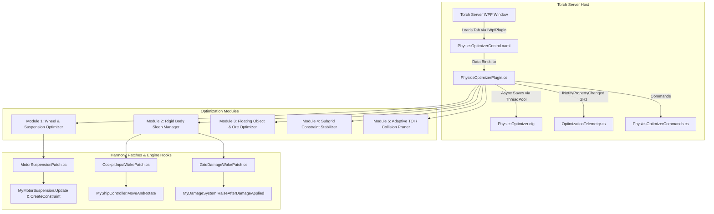

# ⚡ GVK Physics Optimizer

**High-Performance Havok Physics Optimization & Suspension Stabilizer for Space Engineers Torch Servers**

* **Plugin Type**: Torch Dedicated Server Plugin (.NET Framework 4.8)  
* **Target Server**: GV - Deserts of Kharak (GVK)  
* **Package**: `GVK_PhysicsOptimizations.zip`  
* **Version**: 1.1.0  

---

## 1. Project Intent & Philosophy

In Space Engineers, Havok physics calculations consume up to 60–70% of server CPU time on rover-heavy and combat worlds. Server sim-speed craters due to non-critical physics workloads:
1. Active 60Hz physics calculations on motionless and drifting ships.
2. Continuous ground-raycasts, air-shock checks, and suspension math on parked rovers with handbrakes engaged.
3. Hundreds of individual floating ore boulders calculating ground collisions simultaneously after mining or combat.
4. Continuous constraint stress and micro-vibration calculations across resting mechanical subgrids (rotors/hinges/pistons).
5. Continuous collision detection (CCD/TOI) overhead on slow-moving grids.

**`GVK.PhysicsOptimizer`** eliminates these bottlenecks through non-destructive, intelligent deactivation and throttling, maintaining **60 TPS server sim-speed** while leaving vehicle handling, drifting, and combat 100% intact:
* 🏎️ **Consolidated Wheel & Suspension Physics**: Eliminates wheel well armor compound queries, discovers world rovers on server cold start & entity spawns, and sleeps 60Hz raycasts on parked rovers with an ultra-fast ~1ns short-circuit flag.
* 💤 **Aggressive Rigid Body Sleeping**: Actively forces motionless unpiloted dynamic grids into Havok sleep mode (`rigidBody.Deactivate()`), backed by fail-safe flight guards for hovering thrust, locked landing gear/magnets, and autopilot.
* ⛏️ **$O(N)$ Proximity Ore & Item Merging**: Automatically merges floating ore boulders and dropped components using spatial grid hashing and object pooling, slashing active rigid body counts by up to 80% with zero heap allocations.
* 🦾 **Subgrid Constraint Stabilizer & Micro-Dampening**: Dampens constraint tension and actively synchronizes resting subgrid velocities (rotors, hinges, pistons), banishing Clang feedback loops and phantom torque before oscillations begin.
* 🚀 **Adaptive TOI Pruning**: Dynamically assigns discrete collision quality to low-speed cruising grids while preserving continuous TOI for high-speed grids and player-made missiles (PMWs).
* ⚡ **Zero Hot-Path Allocations**: Zero memory allocations in simulation loops with stepped evaluation intervals (30–120 frames), atomic telemetry updates, and deterministic entity eviction on despawn.
* 🛡️ **GridDefender Harmony**: Clean architectural separation—GridDefender handles deformation protection, missile kinetics, and anti-clang voxel nudging, while PhysicsOptimizer manages physics performance & suspension math.

---

## 2. System Architecture



### Project Structure & Key Components

| Component | File | Purpose |
| :--- | :--- | :--- |
| **Plugin Entry** | [`PhysicsOptimizerPlugin.cs`](PhysicsOptimizations/PhysicsOptimizerPlugin.cs) | Main lifecycle controller (`TorchPluginBase`, `IWpfPlugin`). Manages persistent config, telemetry, module updates, entity lifecycle (`OnEntityAdd`/`OnEntityRemove`), and PatchManager. |
| **Config Model** | [`Config/PhysicsOptimizerConfig.cs`](PhysicsOptimizations/Config/PhysicsOptimizerConfig.cs) | Persistent ViewModel containing all configurable thresholds and toggles with Torch `[Display]` annotations. |
| **Telemetry** | [`Services/OptimizationTelemetry.cs`](PhysicsOptimizations/Services/OptimizationTelemetry.cs) | Thread-safe live gauges implementing `INotifyPropertyChanged` for 2Hz WPF dashboard binding (Active/Sleeping bodies, Parked rovers, Sleeping wheels, Merged ore, Stabilized joints). |
| **Module 1 (Wheels)** | [`Modules/WheelOptimizerModule.cs`](PhysicsOptimizations/Modules/WheelOptimizerModule.cs) | Symmetrical broadphase collision masking (`subSystemDontCollideWith = 3`), cold-start rover discovery, and parked rover suspension sleeping with `HasAnySleepingRovers` fast short-circuit. |
| **Module 2 (Sleep)** | [`Modules/RigidBodySleepModule.cs`](PhysicsOptimizations/Modules/RigidBodySleepModule.cs) | Stepped evaluator forcing idle dynamic grids into Havok sleep mode (`rigidBody.Deactivate()`), with fail-safe guards for hovering thrusters, landing gear, and autopilots. |
| **Module 3 (Ore)** | [`Modules/FloatingObjectModule.cs`](PhysicsOptimizations/Modules/FloatingObjectModule.cs) | $O(N)$ spatial grid cell bucketing merging nearby matching ore/item stacks within configured radius using pooled collections to eliminate GC pressure. |
| **Module 4 (Subgrids)**| [`Modules/SubgridStabilizerModule.cs`](PhysicsOptimizations/Modules/SubgridStabilizerModule.cs) | Active Havok micro-velocity dampening and constraint solver stabilization across resting mechanical subgrid joints (rotors, hinges, pistons). |
| **Module 5 (TOI)** | [`Modules/AdaptiveCollisionModule.cs`](PhysicsOptimizations/Modules/AdaptiveCollisionModule.cs) | Switches slow-moving cruising grids to discrete collision quality to eliminate continuous TOI pairs. |
| **Wheel Patch** | [`Patches/MotorSuspensionPatch.cs`](PhysicsOptimizations/Patches/MotorSuspensionPatch.cs) | Hooks `CreateConstraint`, `CubeGrid_OnPhysicsChanged`, and short-circuits `Update()` when rovers are parked. |
| **Cockpit Patch** | [`Patches/CockpitInputWakePatch.cs`](PhysicsOptimizations/Patches/CockpitInputWakePatch.cs) | Postfix on `MyShipController.MoveAndRotate` waking sleeping grids/rovers instantly upon pilot control input. |
| **Damage Patch** | [`Patches/GridDamageWakePatch.cs`](PhysicsOptimizations/Patches/GridDamageWakePatch.cs) | Postfix on `MyDamageSystem.RaiseAfterDamageApplied` waking sleeping rigid bodies upon receiving damage from vanilla weapons, WeaponCore ballistics/beams, tools, or collisions. |
| **Commands** | [`Commands/PhysicsOptimizerCommands.cs`](PhysicsOptimizations/Commands/PhysicsOptimizerCommands.cs) | In-game and Torch console admin commands under the `!phys` prefix using culture-invariant parsing and plain ASCII. |
| **WPF GUI View** | [`Views/PhysicsOptimizerControl.xaml`](PhysicsOptimizations/Views/PhysicsOptimizerControl.xaml) | Dark-themed WPF interface with **Configuration** and real-time **Live Telemetry** tabs. |

---

## 3. Core Optimization Modules Deep-Dive

### 🏎️ Module 1: Wheel & Suspension Physics Optimizer
* **Broadphase Collision Masking**: Space Engineers by default sets asymmetrical sub-system collision masks (`1, 1` on wheels vs `0, 0` on chassis). This causes Havok to perform high-frequency AABB compound shape checks against nearby armor blocks (fenders, wheel skirts, wheel wells) every single tick. The optimizer applies **symmetrical sub-system masking** (`subSystemDontCollideWith = 3` bits 0 and 1), completely eliminating redundant compound tree queries while leaving native wheel-to-ground physics 100% intact.
* **Cold-Start Rover Discovery & Spawn Interception**:
  * In Keen's dedicated server startup sequence, world sector grids load *before* Torch plugins initialize. On startup, `DiscoverExistingRovers()` scans `MyEntities.GetEntities()` to index and optimize all pre-existing rovers immediately.
  * Hooks `MyEntities.OnEntityAdd` to automatically configure newly pasted, projected, or spawned rovers on the fly.
* **Parked Rover Suspension Sleep**: When a rover has its handbrake engaged and remains stationary ($< 0.1 \text{ m/s}$ linear, $< 0.02 \text{ rad/s}$ angular) for $\ge 2.0\text{s}$:
  * Suspends per-frame `MyMotorSuspension.Update()` calls, 60Hz ground raycasts, air-shock checks, and artificial braking impulses.
* **Hot-Path 60Hz Acceleration**: Maintains a static `volatile bool HasAnySleepingRovers` flag. When no rovers on the server are parked, `MotorSuspensionPatch.UpdatePrefix` passes through in ~1ns with zero dictionary hashing or allocations.
* **Instant Wakeup**: Wakes up immediately on handbrake release, pilot movement input (WASD/Space/C), or external impact.

### 💤 Module 2: Rigid Body Sleep Manager (Idle Grid Deactivator)
* **Stepped Scan**: Evaluates dynamic grids every 60 frames (1 second) without hot-path allocations.
* **Sleep Conditions**: If an unpiloted dynamic grid maintains linear velocity $< 0.05 \text{ m/s}$ and angular velocity $< 0.01 \text{ rad/s}$ for $\ge 3\text{ seconds}$, calls `grid.Physics.RigidBody.Deactivate()` to put the Havok rigid body to sleep.
* **Hover & Flight Safety Guards**:
  * **Planetary Gravity Guard**: Grids inside natural gravity will **never** sleep mid-air if thrusters are actively firing against gravity (`thrust.IsWorking && (thrust.ThrustForceLength > 0.01f || thrust.ThrustOverride > 0f)`).
  * **Docking / Landing Support**: Grids in gravity only sleep if wheels are parked, landing gear / magnetic feet are locked (`landingSystem.IsParked || landingSystem.Locked == AllEnabled || landingSystem.Locked == Mixed`), or the grid is an unpowered wreck at rest on voxels.
  * **Piloting & Autopilot Guard**: Protects cockpit pilots, remote control sessions, and active autopilots (`sc.IsAutopilotControlled`).
* **Universal Damage Wake (WeaponCore + Vanilla)**:
  * Hooks `MyDamageSystem.RaiseAfterDamageApplied(object target, MyDamageInformation info)`.
  * Catches all damage sources: vanilla bullets/missiles, WeaponCore ballistics/energy beams/shrapnel, grinder ticks, drill impacts, and physical collisions.

### ⛏️ Module 3: Floating Object & Ore Optimizer
* **Proximity Stack Merging**: Mining drills and rover combat scatter dozens of small ore rocks and dropped items into the world, each calculating independent Havok voxel collisions.
* **$O(N)$ Spatial Grid Hashing**:
  * Replaces legacy $O(N^2)$ all-pairs distance loops with spatial cell bucketing (`Vector3I.Floor(pos / cellSize)`).
  * Only compares items within the same cell or adjacent 26 neighborhood cells.
* **Zero-Allocation Memory Pooling**:
  * Uses pooled list buffers (`_listPool`) and spatial cell dictionary recycling (`RecycleBuckets`), guaranteeing zero heap allocations during proximity merge sweeps.
* **Entity Elimination**: Merges item amounts into a single primary stack entity and closes redundant floating entities, reducing debris physics overhead by up to 80%.

### 🦾 Module 4: Subgrid Constraint Stabilizer & Micro-Dampening
* **Mechanical Joint Evaluation**: Monitors mechanical connection blocks via ModAPI interfaces (`IMyMotorStator`, `IMyPistonBase`), seamlessly supporting vanilla and modded rotors, hinges, and pistons while strictly excluding wheel suspensions.
* **Rest Detection**: When no target velocity is commanded (`TargetVelocityRPM == 0`, `Velocity == 0`), pistons are not extending/retracting, and relative movement is $< 0.005 \text{ rad/s}$ for $> 60\text{ frames}$:
  * Stabilizes constraint solver damping.
  * **Active Havok Micro-Velocity Dampening**: Automatically synchronizes the top grid's `AngularVelocity` and `LinearVelocity` to match the base grid whenever micro-drift exceeds $10^{-6}$.
  * Stops micro-jitter and eliminates Havok constraint solver tension loops across cranes, arms, and rover subparts before Clang can strike.

### 🚀 Module 5: Adaptive TOI (Continuous Collision) Pruning
* **Broadphase TOI Optimization**: Continuous collision detection (CCD/TOI) is computationally expensive in Havok broadphase.
* **Discrete Collision for Slow Grids**: Grids cruising below $15.0 \text{ m/s}$ are set to discrete `Debris` collision quality, bypassing continuous TOI pair generation.
* **Continuous TOI for Fast Grids & Missiles**: High-speed grids ($> 40.0 \text{ m/s}$) and small missiles retain continuous TOI collision to guarantee zero tunneling through voxels or armor.

---

## 4. Engineering Standards & Edge Cases

### A. Non-Conflict Harmony with GridDefender
* **Separation of Concerns**: All wheel broadphase filter masking, suspension throttling, and subgrid micro-dampening live exclusively inside `PhysicsOptimizer`.
* **Anti-Clang Exclusion**: Anti-clang voxel penetration detection and physical nudge/recovery routines are **intentionally omitted** from PhysicsOptimizer. `GridDefender` manages voxel anti-clang and kinetic damage overrides on GVK; running duplicate nudge systems would create severe Havok solver conflicts.

### B. Deterministic Entity Lifecycle & Memory Safety
* Hooks `MyEntities.OnEntityRemove` to instantly evict despawned, deleted, or closed entities from all module dictionaries ($O(1)$ removal).
* Cold-path sweeps (`frameCounter % 300 == 0`) safely clean stale weak references without allocating garbage.
* All temporary sweep buffers (`_cleanupBuffer`, `_removalBuffer`) are flushed with `.Clear()` immediately after processing.

### C. Exception Handling & Zero Empty Catch Rule
* Precondition checks (`if (grid == null || grid.Closed || grid.MarkedForClose) return;`) are used exclusively in place of try/catch blocks on tick updates.
* Delegate event unhooking (`-=`) is executed cleanly without redundant catch blocks.

### D. Client Presentation & Internationalization
* Chat messages, notifications, and console logs strictly use plain ASCII (`- `, `*`, `->`, `[!]`). All unicode emojis and non-standard bullets are banned to prevent Keen's bitmap font renderer from producing "tofu" missing-glyph boxes in in-game chat.
* All numeric formatting and parsing enforce `CultureInfo.InvariantCulture` to prevent comma/period decimal bugs across different server system locales.

### E. Asynchronous Disk I/O
* Live config saves (`!phys toggle`, GUI slider adjustments) offload XML serialization to `ThreadPool.QueueUserWorkItem` under a dedicated lock, preventing server simulation stalls. Server shutdown (`Dispose`) performs a synchronous save.

---

## 5. In-Game & Console Admin Commands (`!phys`)

All commands require `Admin` permission level.

| Command | Description | Example |
| :--- | :--- | :--- |
| `!phys status` | Displays the status of all 5 optimization modules and current thresholds. | `!phys status` |
| `!phys stats` | Outputs real-time telemetry (Active/Sleeping bodies, Parked rovers asleep, Ore merged, Stabilized joints). | `!phys stats` |
| `!phys sleepall` | Forces all eligible idle dynamic grids on the server into Havok sleep mode immediately. | `!phys sleepall` |
| `!phys mergeore` | Triggers an instant proximity merge sweep across all floating ores and dropped items. | `!phys mergeore` |
| `!phys toggle <module>` | Toggles an individual optimization module on or off on the fly (`all`, `wheels`, `mask`, `parkedsleep`, `sleep`, `ore`, `subgrids`, `toi`, `debug`). | `!phys toggle parkedsleep` |
| `!phys reload` | Reloads configuration from `PhysicsOptimizer.cfg` on disk. | `!phys reload` |
| `!phys resetstats` | Resets live telemetry counters to zero. | `!phys resetstats` |

---

## 6. Configuration Reference (`PhysicsOptimizer.cfg`)

The configuration file is saved automatically to `Torch\Plugins\Storage\PhysicsOptimizer\PhysicsOptimizer.cfg` (or in the plugin directory).

### Configuration Options Table

| Setting | Type | Default | Description |
| :--- | :---: | :---: | :--- |
| `Enabled` | `bool` | `true` | Master plugin toggle. |
| `EnableDebugLogging` | `bool` | `false` | Enables verbose trace logging in Torch console. |
| `EnableWheelOptimization` | `bool` | `true` | Master toggle for Module 1 (Wheel & Suspension). |
| `EnableWheelCollisionFilter` | `bool` | `true` | Symmetrical sub-system masking for wheel wells. |
| `SleepParkedRovers` | `bool` | `true` | Pauses 60Hz raycasts & suspension math when parked. |
| `RoverSleepDelaySeconds` | `float` | `2.0` | Motionless seconds before parked rover suspension enters sleep. |
| `EnableAggressiveSleeping` | `bool` | `true` | Master toggle for Module 2 (Rigid Body Sleep). |
| `SleepLinearVelocityThreshold` | `float` | `0.05` | Linear speed (m/s) below which an unpiloted grid is eligible for sleep. |
| `SleepAngularVelocityThreshold` | `float` | `0.01` | Angular speed (rad/s) below which an unpiloted grid is eligible for sleep. |
| `IdleSecondsBeforeSleep` | `int` | `3` | Motionless seconds required before deactivating grid rigid body. |
| `EnableFloatingObjectOptimizer` | `bool` | `true` | Master toggle for Module 3 (Floating Objects & Ore). |
| `AutoMergeNearbyOre` | `bool` | `true` | Automatically merges matching floating ores/items within proximity. |
| `OreMergeRadiusMeters` | `float` | `3.0` | Spatial radius (meters) for proximity ore clustering. |
| `OreMergeIntervalTicks` | `int` | `120` | Simulation ticks between proximity merge sweeps (60 = 1 sec). |
| `MaxSectorFloatingObjects` | `int` | `64` | Local area floating object threshold. |
| `EnableSubgridStabilization` | `bool` | `true` | Master toggle for Module 4 (Subgrid Constraint Stabilizer). |
| `SubgridRestVelocityThreshold` | `float` | `0.005` | Joint angular velocity threshold (rad/s) to consider subgrid at rest. |
| `SubgridRestFramesThreshold` | `int` | `60` | Consecutive rest frames (~1 sec) before locking constraint damping. |
| `EnableAdaptiveTOI` | `bool` | `true` | Master toggle for Module 5 (Adaptive TOI Collision Pruning). |
| `ContinuousCollisionSpeedThreshold` | `float` | `40.0` | Speed (m/s) above which grids retain continuous TOI collision. |
| `DiscreteCollisionSpeedThreshold` | `float` | `15.0` | Speed (m/s) below which grids use discrete collision quality. |

---

## 7. Torch WPF Server Interface

The GUI integrates into the Torch Server window, matching the standard dark-themed layout of `GridDefender` and `TorchRemoteCleanupPlugin`:

1. **Configuration Tab**:
   * Quick overview banner highlighting active optimization systems.
   * Granular module toggles, threshold textboxes, and sliders.
   * Quick **"Save Configuration"** button.
2. **Live Telemetry Tab**:
   * **Real-Time 2Hz Updating**: Implements `INotifyPropertyChanged` on the WPF dispatcher thread for fluid, live gauge monitoring with zero allocations on simulation threads.
   * **4-Column Metric Card**: Active Bodies (Red), Sleeping Bodies (Green), Rovers Asleep (Blue), and Sleeping Wheels (Green).
   * **Detailed Telemetry Breakdown**: Merged ore stacks, eliminated entities, forced sleep events, stabilized subgrid joints, and discrete TOI grid counts.
   * **Manual Action Controls**: `Force Sleep All Idle Grids`, `Run Ore Proximity Merge Now`, and `Reset Counters`.

---

## 8. Building & Deployment

### 1. Configure Torch Directory Path
Open [`PhysicsOptimizations.csproj`](PhysicsOptimizations/PhysicsOptimizations.csproj) and verify `<TorchDir>`:
```xml
<TorchDir>C:\SE_GVK_S10</TorchDir>
```

### 2. Build the Solution
```bash
dotnet build -c Release PhysicsOptimizations\PhysicsOptimizations.csproj
```
The build automatically creates and deploys the zip archive:
```
C:\SE_GVK_S10\Plugins\GVK_PhysicsOptimizations.zip
├── GVK.PhysicsOptimizations.dll
├── GVK.PhysicsOptimizations.pdb
└── manifest.xml
```

---

## 9. In-Game Testing Checklist

1. **GUI & Persistence Verification**:
   - [ ] Start Torch Server $\rightarrow$ Open **GVK Physics Optimizer** tab.
   - [ ] Verify both **Configuration** and **Live Telemetry** tabs are populated and telemetry values refresh live.
   - [ ] Modify a threshold (e.g. Rover Sleep Delay) and click **Save Configuration**.
2. **Module 1 (Wheels) Verification**:
   - [ ] Spawn a rover and drive it onto terrain.
   - [ ] Engage the handbrake and let it sit for $> 2$ seconds.
   - [ ] Check **Live Telemetry** $\rightarrow$ Verify **Rovers Asleep** and **Sleeping Wheels** increment.
   - [ ] Press `W` (throttle) $\rightarrow$ Verify suspension wakes up immediately with zero input lag.
3. **Module 2 (Rigid Body Sleep) Verification**:
   - [ ] Spawn an unpiloted dynamic ship and let it come to a complete stop.
   - [ ] Verify **Sleeping Bodies** increments after 3 seconds.
   - [ ] Shoot the ship with vanilla or WeaponCore weapons $\rightarrow$ Verify it immediately wakes up and responds to physics forces.
   - [ ] Hover a ship in natural gravity $\rightarrow$ Verify active thrusters prevent it from freezing mid-air.
4. **Module 3 (Ore Merging) Verification**:
   - [ ] Drop or mine multiple ore boulders within 3 meters of each other.
   - [ ] Verify the boulders merge into a single larger stack and redundant entities are removed.
5. **Module 4 (Subgrids) Verification**:
   - [ ] Spawn a ship with a multi-joint rotor/piston crane at rest.
   - [ ] Verify **Stabilized Subgrid Joints** increments and joint micro-jitter stops.

---

## 10. License & Credits

* **Author**: GVK Modding Team
* **Target Server**: GV - Deserts of Kharak (GVK)
* **License**: MIT

